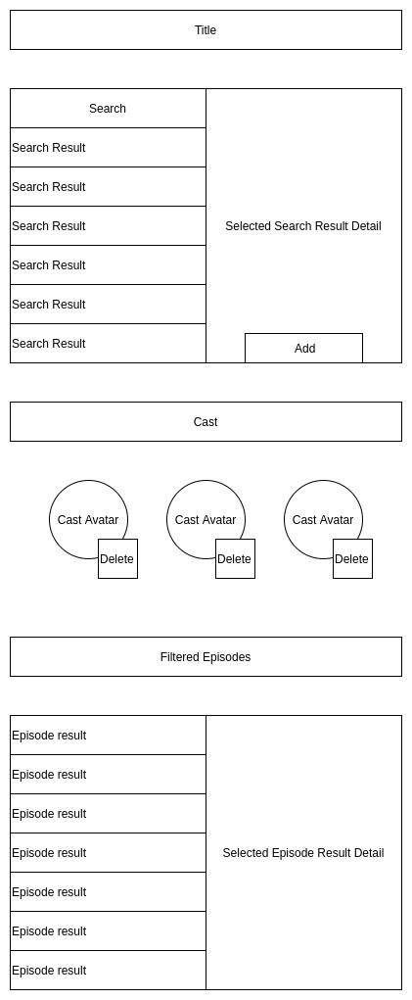

# Star Trek Cast Filter

## Description

Trekkies looking to get the most out of their fandom will use this application to find the episodes in which all their favorite characters appear.

Users will use a search bar to find their favorite characters, view details on that character, and add them to their cast. Users will also be able to remove members from their cast.

Episodes will be listed that contain all the selected cast members. Users will be able to view a summary of the episode when they select a result in the list.

## Wireframes

## Dependencies

- [Star Trek API](http://stapi.co/)
- [styled-components](https://styled-components.com/)
- [react-icons](https://www.npmjs.com/package/react-icons)

## Tasks

- [ ] Setup `create-react-app` scaffold - Week 1
- [ ] Create components and fill with dummy data - Week 1
- [ ] Implement character searching, character adding/removing, and episode filtering functionality - Week 1
- [ ] Implement calling the API - Week 2
- [ ] Style to delight - Week 2
- [ ] Hosting solution - Week 2
- [ ] [Extension goal] Host using kubernetes on EKS - Week 3
